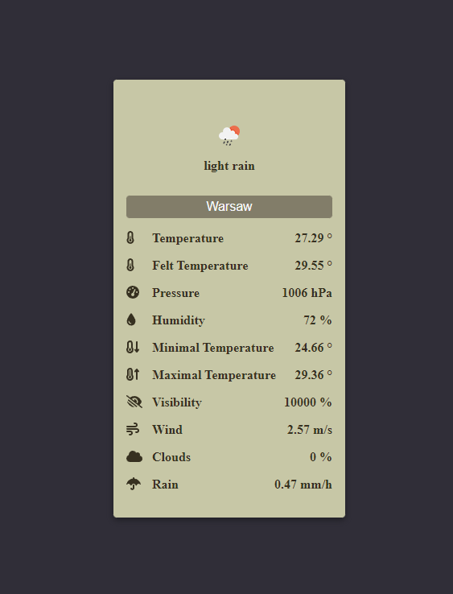

[](https://www.npmjs.com/package/dynamodb-onetable)
[](https://www.npmjs.com/package/dynamodb-onetable)
[](https://coveralls.io/github/JamesHawkJ/open-weather-map-widget?branch=main)

# Open-Weather-Map Widget

Welcome!

This is a widget showing weather information queried from the open weather map api written in react.

By default it shows the general weather condition, the temperature, the pressure and the humidity of a city you put into the search input.


If something doesn’t work, please [file an issue](https://github.com/JamesHawkJ/react-open-weather-map-widget/issues/new).<br>
If you have questions or need help, please ask in [GitHub Discussions](https://github.com/JamesHawkJ/react-open-weather-map-widget/discussions).

## Installation

```sh
npm i react-open-weather-map-widget
```

## Get Started

!!Before you start you need to create an account on [Open Weather Map](https://openweathermap.org/) and [generate an *API Key*](https://home.openweathermap.org/api_keys)!!

After downloading the package import the weather widget component and use it.

You'll need to pass the API Key as a prop to the component. The prop is called `appid`.


## Example

To try out the example clone this repository, then insert you API key as the appid prop at `src/index.tsx` and run `npm run start`.

You should see this view:


The widget indicates that 's it;s fetching data by a spinner on the right of the input field like so:


If you don't set the appid prop or your API key is invalid you will see and error icon and on hover you'll see an error message like in this example:


## Customization

You can customize the widget by setting optional props:


The `flavor` prop decides about the view of the widget. You can choose either `card` or `bar`. Bar is set by default. Check the [Styling section](#Styling) to learn more about the views.

You can choose one of the preset themes by setting `theme` to `light` or `dark` or you can create your custom theme and pass it to the `style` prop. Check the [Styling section](#Styling) to learn more about the themes.

You can set a default city as auto fill to the input by setting the `defaultCity` prop.

You can alter the update speed of the widget which is set by default to 30 seconds by setting the `updateSpeed` prop.

You can set boolean flags to change the weather data that will be shown by the widget. *Each section will show only if it's corresponding data is available in the fetch response!*

There are 14 sections that you can show/hide in total. Here's the list with their default values:

```sh
    showWeatherCondition = true
    showMainTemperature = true
    showFeltTemperature = false
    showPressure = true
    showHumidity = true
    showMinimalTemperature = false
    showMaximalTemperature = false
    showSeaLevelPressure = false
    showGroundLevelPressure = false
    showVisibility = false
    showWind = false
    showClouds = false
    showRain = false
    showSnow = false
```


## Styling

There are two main customization options you can set.

The first one is the `flavor`. You can choose to have the widget show as a card or a bar.




The second choise is choosing the theme. The images above show when the default theme is set so `light`. Here's an example of the `dark` theme:


You can create your own theme by passing a styling object to the `style` prop.

It must implement this interface:


Here's the dark theme as an example:


